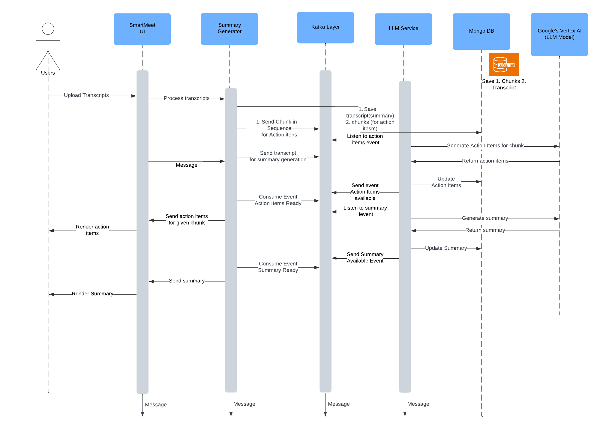

# Problem Statement
This repository hosts SmartMeet, an automated tool that effectively summarizes meetings, highlights key discussion points, and generates personalized to-do lists for each attendee and also creates JIRA tracking tickets.

# Architecture Diagram


# Sequence Diagram


# Installation Steps
## UI

## Backend Technologies
### Java

1. Install Java 11 (MAC OS)
```
brew install openjdk@11
```

2. Add PATH and JAVA_HOME as path variables
```
echo 'export PATH="/opt/homebrew/opt/openjdk@11/bin:$PATH"' >> ~/.zshrc
echo 'export JAVA_HOME="/opt/homebrew/opt/openjdk@11"' >> ~/.zshrc
source ~/.zshrc
```

3. Verify if Java is installed successfully
```
java -version
```

### Maven

1. Install Maven using Homebrew
```angular2html
brew install maven
```
2. Add PATH variables
```angular2html
nano ~/.zshrc
Add -> export PATH="/opt/homebrew/Cellar/maven/3.9.9/libexec/bin:$PATH"
source ~/.zshrc
```

3. Verify Installation
```angular2html
mvn -version
```

### MongoDB
1. Install mongodb as docker container
```angular2html
docker pull mongo
docker run --name mongodb -d -p 27017:27017 mongo
```

2. Verify if mongo is running
```angular2html
docker ps | grep mongo
```

### MongoDB Compass (Install for convenience)
1. Download MongoDB Compass from their official website
   https://www.mongodb.com/products/tools/compass
2. Install the exec or dmg file
3. Pass the connection string mentioned below in order to establish connection with mongo running as docker container
```angular2html
mongodb://localhost:27017
```
4. Create Database named "Smartmeet" and add two collections ""action-items" and "transcript-summaries"

### Kafka
1. We will run Kafka and ZooKeeper as docker containers
2. There's "kafka-docker-compose.yml" file in summary-generator. Run that file or "docker-compose up -d" so it will pull docker images for Kafka and Zookeeper and run the container
3. Verify if Kafka and Zookeeper are running
```angular2html
docker ps | grep kafka
docker ps | grep zookeeper
```
4. Create 4 kafka topics using command.
```angular2html
docker exec -it kafka bash
kafka-topics --create --topic llm_service.events.generate.action.items --bootstrap-server localhost:9092 --partitions 1 --replication-factor 1
kafka-topics --create --topic llm_service.events.generate.summary --bootstrap-server localhost:9092 --partitions 1 --replication-factor 1
kafka-topics --create --topic summary.generator.events.action.items --bootstrap-server localhost:9092 --partitions 1 --replication-factor 1
kafka-topics --create --topic summary.generator.events.summary --bootstrap-server localhost:9092 --partitions 1 --replication-factor 1

```
4. If you want to check logs, exec into kafka container if not already and run the command

```angular2html
docker exec -it kafka bash
kafka-console-consumer --topic llm_service.events.generate.action.items --bootstrap-server localhost:9092 --from-beginning
```

### Postman
1. Download executable file from Postman's website and install it
2. This can be used to make API calls

# How to Run the code
1. Initiate UI Server
```angular2html
npm install
npm run dev
```
2. Initiate Summary-Generator Server
```angular2html
mvn clean install
mvn spring-boot:run
```

3. Initiate LLM Service
```angular2html
pip install -r requirements.txt
python3 start llmServer.py
python3 start llmServerSummary.py
```